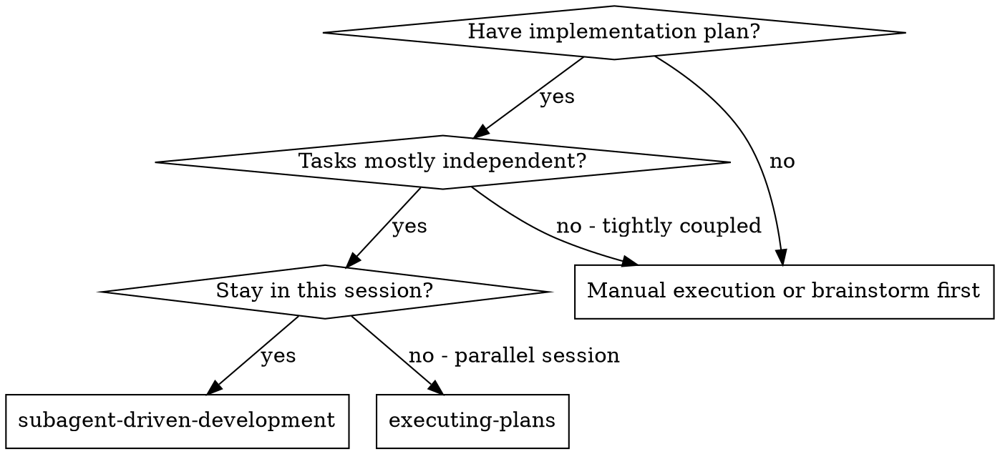
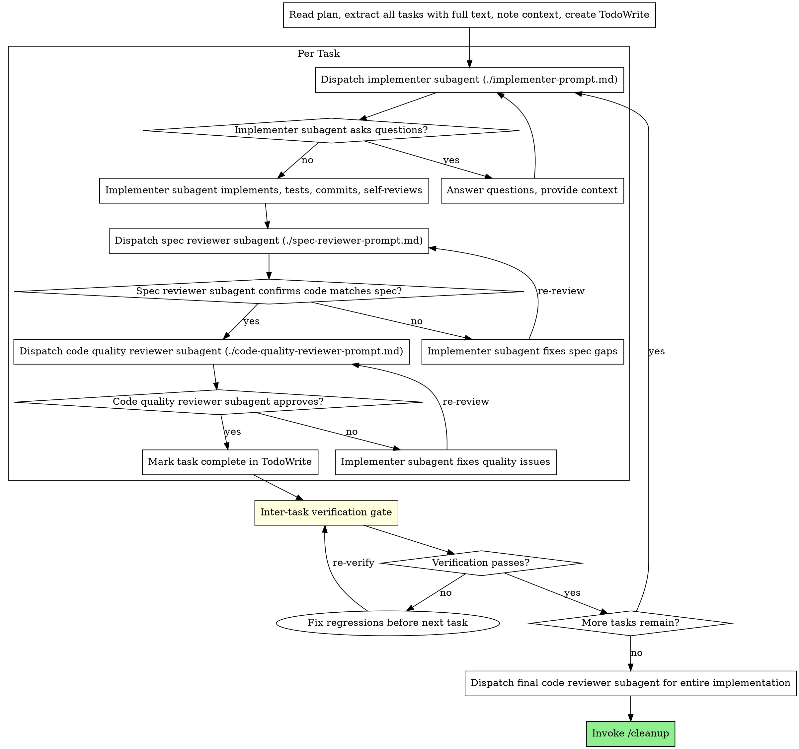

# Subagent-Driven Development

Execute plan by dispatching fresh subagent per task, with two-stage review after each: spec compliance review first, then code quality review.

**Core principle:** Fresh subagent per task + two-stage review (spec then quality) = high quality, fast iteration

## When to Use



**vs. Executing Plans (parallel session):**
- Same session (no context switch)
- Fresh subagent per task (no context pollution)
- Two-stage review after each task: spec compliance first, then code quality
- Faster iteration (no human-in-loop between tasks)

## The Process



## Prompt Templates

Siblings in this directory:
- `./implementer-prompt.md` — Dispatch implementer subagent
- `./spec-reviewer-prompt.md` — Dispatch spec compliance reviewer subagent
- `./code-quality-reviewer-prompt.md` — Dispatch code quality reviewer subagent

## Pre-Dispatch: Memory Injection

Before dispatching the FIRST implementer subagent in this plan, apply the memory-injection pattern (see `memory-injection.md` in this directory) to pull project-specific gotchas from MEMORY.md into every subsequent dispatch prompt:

1. Collect the full list of files the plan will touch (across all tasks)
2. Run memory-injection with that file list — it returns a `PROJECT GOTCHAS` block
3. Cache the block; prepend it to every implementer prompt's PROJECT CONTEXT area
4. Only re-run memory-injection if the file scope shifts materially mid-plan (e.g., new files added during review fixes)

If no MEMORY.md exists or no domains match, memory-injection returns nothing — proceed without the block. This is a graceful no-op, not an error.

**Why:** subagent-driven-development dispatches code-writing agents fresh per task. Without memory injection, project-specific gotchas captured in MEMORY.md (e.g., "is_primary_contact not is_primary", "eager-load discipline", "no alias methods") silently recur because each fresh subagent has no exposure to them. This is the single highest-leverage safety net for cross-session consistency.

## Pre-Dispatch: Per-Step Lookup Injection

Before dispatching each implementer subagent, run the **step-scope** lookup
pass to inject file-level facts the implementer needs for THIS task:

```
python3 <claude-flow-root>/scripts/inject_lookups.py \
    --scope step \
    --files <files-this-task-touches> \
    --json
```

Prepend the output's `lookups` section to the implementer prompt, in the
PROJECT CONTEXT area:

```
STEP-SPECIFIC LOOKUPS (authoritative — use these exact names):
[sqlalchemy_columns]
<output>

[css_classes]
<output>

[react_components]
<output>
```

This is **narrower** than the plan-wide lookups injected in Phase 5
pre-implementation (which cover alembic heads, all existing routes, etc.).
Step-scope covers facts specific to the files THIS implementer is modifying.

**Why:** prevents hallucinated column names, CSS class names, and component
imports at authoring time — the implementer sees real names before writing
any code. Inspired by Brian/Notion's `find-icon` skill.

If `lookups` is empty (all step-scope detectors skipped), omit the section.

**Skip-envelope contract:** `inject_lookups.py` uses a graceful-skip design (see memory: `optional_dep_gate_policy`) — missing tools, inapplicable detectors, or absent project structure all produce a skip entry, never a non-zero exit. Only a non-zero exit code or malformed JSON is a real failure that should block dispatch.

## Direct Execution — When to Skip the Subagent Cycle

For very small, architecturally-unambiguous tasks, the controller executes directly instead of dispatching an implementer + two reviewers. Direct execution is an intentional efficiency move, not a shortcut around review — the controller self-verifies by reading the diff, running the test, and checking scope.

**Direct execution is appropriate when ALL of the following hold:**

- Change is **under ~50 lines** (typical: 1-20 lines)
- Change is **architecturally unambiguous** — the plan specifies exact content or the edit is mechanical (e.g. "add this row to the table", "add this JSON entry to the array")
- No new behavioral code (no new functions, no new control flow) — docs, config, fixtures, or small test extensions only
- Controller has read-access to the target file already (no unfamiliar context)
- Verification is deterministic (JSON validates, tests run green, diff stats match expectation)

**Allowed shapes (observed to work cleanly):**

| Shape | Example |
|---|---|
| Registry / config additions (<20 lines) | Adding a reviewer entry to `reviewer-registry.json` |
| Single-row table prose edits | Adding a row to the Phase 6 Default Reviewers table |
| Pytest assertion appendages | Adding 2 new `test_*` assertions to an existing `test_file.py` |
| Small markdown doc blocks | 17-line additive section in a phase file |
| Post-review cleanups | 2-line dead-code removal flagged by code-quality reviewer |

**Direct execution is NOT appropriate when:**

- New file with behavioral code (even a small script) — dispatch an implementer for TDD
- Any change that could legitimately have multiple correct implementations — reviewer value is in catching divergence
- Cross-cutting changes (same rule applied to 3+ files) — the review catches coherence problems
- Anything where the controller has not read the target file recently

**Verification obligation when executing directly:**

After the edit, the controller MUST run — in the same turn — the same checks a code-quality reviewer would:
1. Diff-stat check: `git diff --cached --stat` touches only the intended file(s)
2. Syntactic validity: JSON parses / Markdown renders / Python test runs
3. Behavioral check: the test the change is supposed to affect passes (or fails in the intended way for TDD red)

If any check fails, revert and dispatch a subagent instead. Direct execution without self-verification is the anti-pattern this section is trying to prevent.

## Carry Lessons Across Task Groups

After each task group's review cycle completes, scan spec-review and code-quality findings for **reusable lessons** (shell portability, tool-version quirks, cross-cutting idioms). Fold those lessons into the **next task group's dispatch prompt** as an explicit "known gotchas — avoid these" block with evidence (commit refs, specific failure modes).

Do NOT carry task-specific bugs (they rarely recur). Only cross-cutting patterns. See `proactive_lessons_in_dispatch_prompt.md` in MEMORY.

In the 2026-04-17 hook-improvements session, pre-seeding Task Group 2 (JS/TS lint gate) with 5 lessons from Task Group 1 (Python lint gate) eliminated re-discovery of bash 3.2 parse errors, mktemp extension-leak, apostrophe-in-heredoc, and exit-code-vs-regex issues — saved ~2 review/fix cycles.

## Clarification Windows

Implementers follow a two-window clarification model:

- **Pre-start (wide):** ask freely about requirements, approach, dependencies, anything unclear in the task description. This is the authorized window for questions.
- **Mid-work (narrow):** only plan-breaking blockers (plan contradiction, unreachable acceptance criteria, critical architectural blocker the plan didn't anticipate). Routine ambiguity is resolved by judgment; assumptions are documented in the final report for reviewer validation.

See `implementer-prompt.md` for the authoritative prompt. Rationale: parallel-dispatched implementers stall the whole batch on any single mid-work clarifier — documented assumptions are reviewable, but mid-task stalls are pure latency.

## Example Workflow

```
You: I'm using Subagent-Driven Development to execute this plan.

[Read plan file once: docs/plans/feature-plan.md]
[Extract all 5 tasks with full text and context]
[Create TodoWrite with all tasks]

Task 1: Hook installation script

[Get Task 1 text and context (already extracted)]
[Dispatch implementation subagent with full task text + context]

Implementer: "Before I begin - should the hook be installed at user or system level?"

You: "User level (~/.config/superpowers/hooks/)"

Implementer: "Got it. Implementing now..."
[Later] Implementer:
  - Implemented install-hook command
  - Added tests, 5/5 passing
  - Self-review: Found I missed --force flag, added it
  - Committed

[Dispatch spec compliance reviewer]
Spec reviewer: ✅ Spec compliant - all requirements met, nothing extra

[Get git SHAs, dispatch code quality reviewer]
Code reviewer: Strengths: Good test coverage, clean. Issues: None. Approved.

[Mark Task 1 complete]

Task 2: Recovery modes

[Get Task 2 text and context (already extracted)]
[Dispatch implementation subagent with full task text + context]

Implementer: [No questions, proceeds]
Implementer:
  - Added verify/repair modes
  - 8/8 tests passing
  - Self-review: All good
  - Committed

[Dispatch spec compliance reviewer]
Spec reviewer: ❌ Issues:
  - Missing: Progress reporting (spec says "report every 100 items")
  - Extra: Added --json flag (not requested)

[Implementer fixes issues]
Implementer: Removed --json flag, added progress reporting

[Spec reviewer reviews again]
Spec reviewer: ✅ Spec compliant now

[Dispatch code quality reviewer]
Code reviewer: Strengths: Solid. Issues (Important): Magic number (100)

[Implementer fixes]
Implementer: Extracted PROGRESS_INTERVAL constant

[Code reviewer reviews again]
Code reviewer: ✅ Approved

[Mark Task 2 complete]

...

[After all tasks]
[Dispatch final code-reviewer]
Final reviewer: All requirements met, ready to merge

Done!
```

## Advantages

**vs. Manual execution:**
- Subagents follow TDD naturally
- Fresh context per task (no confusion)
- Parallel-safe (subagents don't interfere)
- Subagent can ask questions (before AND during work)

**vs. Executing Plans:**
- Same session (no handoff)
- Continuous progress (no waiting)
- Review checkpoints automatic

**Efficiency gains:**
- No file reading overhead (controller provides full text)
- Controller curates exactly what context is needed
- Subagent gets complete information upfront
- Questions surfaced before work begins (not after)

**Quality gates:**
- Self-review catches issues before handoff
- Two-stage review: spec compliance, then code quality
- Review loops ensure fixes actually work
- Spec compliance prevents over/under-building
- Code quality ensures implementation is well-built

**Cost:**
- More subagent invocations (implementer + 2 reviewers per task)
- Controller does more prep work (extracting all tasks upfront)
- Review loops add iterations
- But catches issues early (cheaper than debugging later)

## Red Flags

**Never:**
- Start implementation on main/master branch without explicit user consent
- Skip reviews (spec compliance OR code quality)
- Proceed with unfixed issues
- Dispatch multiple implementation subagents in parallel (conflicts)
- Make subagent read plan file (provide full text instead)
- Skip scene-setting context (subagent needs to understand where task fits)
- Ignore subagent questions (answer before letting them proceed)
- Accept "close enough" on spec compliance (spec reviewer found issues = not done)
- Skip review loops (reviewer found issues = implementer fixes = review again)
- Let implementer self-review replace actual review (both are needed)
- **Start code quality review before spec compliance is ✅** (wrong order)
- Move to next task while either review has open issues

**If subagent asks questions:**
- Answer clearly and completely
- Provide additional context if needed
- Don't rush them into implementation

**If reviewer finds issues:**
- Implementer (same subagent) fixes them
- Reviewer reviews again
- Repeat until approved
- Don't skip the re-review

**If subagent fails task:**
- Dispatch fix subagent with specific instructions
- Don't try to fix manually (context pollution)

**If subagent reports a file missing that you verified exists:**
- Treat it as a stale workspace view, not ground truth. Subagents occasionally have cached/partial views of the filesystem or a failed `find`.
- Re-dispatch with the **absolute path** and an alternative read command (`"use cat via Bash"` or `"use the Read tool with this absolute path"`).
- Do not accept "not found" without verifying via a second method.

**If a subagent completion notification arrives after you already processed its output:**
- Background subagent completions are delivered as what looks like a new user turn. If you already handled the synchronous result, the notification is stale.
- Recognize by: agent ID matches a subagent you already handled, or content duplicates a prior completion report.
- Do not treat as a new prompt or re-run the task.

**Self-debugging integration:** When a subagent's work fails verification (test or lint), use the retry loop defined in `claude-flow` Phase 5. Emit failure events, match against the failure catalog, and escalate thinking budget per attempt. Do not silently retry without emitting events.

## Inter-Task Verification Gate

After each task completes (both reviews pass, task marked done), run a proactive verification gate **before** dispatching the next implementer. This catches regressions early instead of discovering them after 3 more tasks have built on a broken foundation.

```
Mark task complete
        │
        ▼
┌──────────────────────────────────────────┐
│ INTER-TASK VERIFICATION GATE             │
│                                          │
│ 1. Run full test suite (not just the     │
│    tests for the completed task)         │
│                                          │
│ 2. Run linter on all modified files      │
│    accumulated so far                    │
│                                          │
│ 3. Quick build check (does it compile/   │
│    start without errors?)                │
│                                          │
│ ALL PASS → continue to next task         │
│ ANY FAIL → fix before proceeding         │
└──────────────────────────────────────────┘
        │
        ▼
  Next task (or final review if done)
```

### What to run

| Check | Command (adapt to project) | Purpose |
|-------|---------------------------|---------|
| Tests | `pytest tests/ -x -q` or `npm test` | Catch regressions from latest task |
| Lint | `ruff check app/` or `eslint src/` | Catch style/import issues before they compound |
| Build | `python -c "from app.main import app"` or `npm run build` | Catch import errors, missing deps |

**Adapt commands** to the project's stack. Use whatever the project's CI runs. The goal is a fast smoke check (under 60 seconds), not exhaustive validation.

### When verification fails

1. **Identify** whether the failure is from the just-completed task or a pre-existing issue
2. **If from current task:** Dispatch a fix subagent with the error output and the task context. Use the Phase 5 retry loop (emit events, match catalog, escalate thinking).
3. **If pre-existing:** Log it, note it in the handoff, but proceed — don't block on issues that existed before this session.
4. **Re-run verification** after fix. Only proceed when all checks pass.
5. **Max 2 fix attempts** per gate. If still failing, surface to user: "Task N introduced a regression I can't auto-fix. Error: [output]. Need guidance."

### When to skip

- **Task 1:** Skip the full test suite run (no prior tasks to regress against). Still run lint and build.
- **Trivial tasks:** Config changes, documentation-only tasks, or tasks that don't touch executable code can skip the full suite. Still run lint.
- **Explicitly independent tasks:** If the plan explicitly marks tasks as having zero shared state, the gate can run only the build check.
- **Typed dependencies:** When the input plan includes typed dependencies (`data`, `build`, `knowledge`), respect them: `data`/`build` edges are strictly sequential; `knowledge` edges are parallelizable (record assumptions in each subagent's context). If no typed dependencies are present, fall back to existing independence heuristics.
- **No test runner available:** If the project has no test suite (e.g., pure scripts, config-only repos), skip the suite check and run only lint + build.

### Why this matters

Without inter-task verification, a subtle regression in Task 2 compounds silently through Tasks 3-5. By Task 6, the failure is far from its cause and expensive to debug. The gate costs ~30-60 seconds per task but prevents the "everything broke and I don't know when" scenario.

## Integration

**Required workflow skills:**
- **superpowers:using-git-worktrees** - REQUIRED: Set up isolated workspace before starting
- **superpowers:writing-plans** - Creates the plan this skill executes
- **superpowers:requesting-code-review** - Code review template for reviewer subagents
- **`/cleanup`** - Complete development after all tasks (branch teardown + session-learnings + repo sync)

**Subagents should use:**
- `test-driven-development.md` (in this directory) — Subagents follow TDD for each task

**Alternative workflow:**
- **superpowers:executing-plans** - Use for parallel session instead of same-session execution
