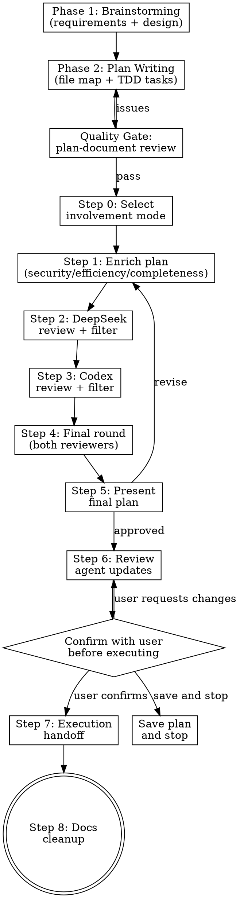

# PlanCraft

## Overview

Multi-agent planning skill that chains six phases:
1. **Brainstorming** — Requirements exploration and design approval
2. **Plan Writing** — Detailed TDD implementation plan with bite-sized tasks (built-in)
3. **AI Review** — DeepSeek (security/architecture) + OpenAI (code quality/efficiency) review
4. **Review & Confirm** — Summarize agent updates and get user confirmation before executing
5. **Execution** — Invokes `superpowers:executing-plans` after user confirms
6. **Docs Cleanup** — Automatically invokes `/docs-cleanup` to archive plans and update documentation

**Announce:** "I'm using PlanCraft to create a multi-model reviewed implementation plan. This includes brainstorming, detailed plan writing, AI review, user confirmation, execution, and documentation cleanup."

## Architecture

This skill uses **direct API calls** (not MCP servers). A Python script at `~/.claude/scripts/plancraft_review.py` calls the DeepSeek and OpenAI APIs directly. Claude orchestrates the workflow and calls the script via Bash.

### Prerequisites

Before starting, verify the review script and dependencies exist:

```bash
python3 -c "import httpx; print('httpx OK')" && \
  test -f ~/.claude/scripts/plancraft_review.py && \
  echo "PlanCraft ready"
```

If `httpx` is missing: `pip install httpx`

API keys must be set as environment variables:
- `DEEPSEEK_API_KEY` — Get from https://platform.deepseek.com/api_keys
- `OPENAI_API_KEY` — Get from https://platform.openai.com/api-keys

The script auto-loads keys from shell config files (`~/.zshrc`, `~/.bash_profile`, `~/.bashrc`, `~/.zprofile`) if they aren't in the current environment. No manual `source` is needed.

Check: `python3 ~/.claude/scripts/plancraft_review.py --reviewer deepseek --plan-file /dev/null --scope-file /dev/null 2>&1 | head -1` (should not show "API key not set" error)

## Workflow



## Phase 1: Brainstorming

**Before any planning begins, run a brainstorming session.** This explores requirements and creates a validated design document.

<HARD-GATE>
Do NOT proceed to plan writing until brainstorming is complete and a design document has been approved by the user.
</HARD-GATE>

### Brainstorming Checklist

Create a task for each item and complete in order:

1. **Explore project context** — check files, docs, recent commits relevant to the feature
2. **Ask clarifying questions** — one at a time, understand purpose/constraints/success criteria
3. **Propose 2-3 approaches** — with trade-offs and your recommendation
4. **Present design** — in sections scaled to complexity, get user approval after each section
5. **Write design doc** — save to `docs/plans/YYYY-MM-DD-<topic>-design.md` and commit
6. **Extract scope** — from the approved design, define explicit In Scope / Out of Scope lists

### Brainstorming Process

**Understanding the idea:**
- Check out the current project state first (files, docs, recent commits)
- Ask questions one at a time to refine the idea
- Prefer multiple choice questions when possible
- Focus on understanding: purpose, constraints, success criteria

**Exploring approaches:**
- Propose 2-3 different approaches with trade-offs
- Lead with your recommended option and explain why
- Present options conversationally

**Presenting the design:**
- Scale each section to its complexity (few sentences if simple, 200-300 words if nuanced)
- Ask after each section whether it looks right so far
- Cover: architecture, components, data flow, error handling, testing

**Documentation:**
- Write the validated design to `docs/plans/YYYY-MM-DD-<topic>-design.md`
- Commit the design document to git
- This design doc becomes the foundation for Phase 2

## Phase 2: Plan Writing

Write the implementation plan directly — this phase is self-contained. The goal is a plan so detailed that an engineer with zero codebase context can follow it step by step. Document everything: which files to touch, complete code, test commands with expected output.

Assume the implementer is a skilled developer but knows nothing about your toolset or problem domain, and doesn't know good test design very well.

<HARD-GATE>
Do NOT proceed to AI review until the plan has exact file paths, complete code, and TDD test steps for every task.
</HARD-GATE>

### Scope Check

If the design doc covers multiple independent subsystems, break it into separate plans — one per subsystem. Each plan should produce working, testable software on its own.

### File Structure Map

Before defining tasks, map out which files will be created or modified and what each one is responsible for. This is where decomposition decisions get locked in.

- Design units with clear boundaries and well-defined interfaces. Each file should have one clear responsibility.
- Prefer smaller, focused files over large ones that do too much — you reason best about code you can hold in context at once, and edits are more reliable when files are focused.
- Files that change together should live together. Split by responsibility, not by technical layer.
- In existing codebases, follow established patterns. If the codebase uses large files, don't unilaterally restructure — but if a file you're modifying has grown unwieldy, including a split in the plan is reasonable.

This structure informs the task decomposition. Each task should produce self-contained changes that make sense independently.

### Task Granularity

**Each step is one action (2-5 minutes):**
- "Write the failing test" — step
- "Run it to make sure it fails" — step
- "Implement the minimal code to make the test pass" — step
- "Run the tests and make sure they pass" — step
- "Commit" — step

### Plan Document Header

Every plan starts with this header:

```markdown
# [Feature Name] Implementation Plan

> **For agentic workers:** REQUIRED SUB-SKILL: Use superpowers:subagent-driven-development (recommended) or superpowers:executing-plans to implement this plan task-by-task. Steps use checkbox (`- [ ]`) syntax for tracking.

**Goal:** [One sentence describing what this builds]

**Architecture:** [2-3 sentences about approach]

**Tech Stack:** [Key technologies/libraries]

**Design Document:** `docs/plans/YYYY-MM-DD-<topic>-design.md`

## Scope
### In Scope
### Out of Scope

---
```

### Task Structure Template

````markdown
### Task N: [Component Name]

**Files:**
- Create: `exact/path/to/file.py`
- Modify: `exact/path/to/existing.py:123-145`
- Test: `tests/exact/path/to/test.py`

- [ ] **Step 1: Write the failing test**

```python
def test_specific_behavior():
    result = function(input)
    assert result == expected
```

- [ ] **Step 2: Run test to verify it fails**

Run: `pytest tests/path/test.py::test_name -v`
Expected: FAIL with "function not defined"

- [ ] **Step 3: Write minimal implementation**

```python
def function(input):
    return expected
```

- [ ] **Step 4: Run test to verify it passes**

Run: `pytest tests/path/test.py::test_name -v`
Expected: PASS

- [ ] **Step 5: Commit**

```bash
git add tests/path/test.py src/path/file.py
git commit -m "feat: add specific feature"
```
````

### Plan Writing Checklist

- Exact file paths always (with line numbers for modifications)
- Complete code in plan (not "add validation" — show the actual code)
- Exact commands with expected output
- Reference relevant skills with @ syntax
- DRY, YAGNI, TDD, frequent commits

### Quality Gate: Plan Document Review

After writing the complete plan, dispatch a single reviewer subagent to verify the plan is ready for AI review. This catches structural gaps before spending API calls on DeepSeek/Codex.

Dispatch a general-purpose subagent with this prompt:

```
You are a plan document reviewer. Verify this plan is complete and ready for implementation.

**Plan to review:** [PLAN_FILE_PATH]
**Spec for reference:** [DESIGN_DOC_PATH]

## What to Check

| Category | What to Look For |
|----------|------------------|
| Completeness | TODOs, placeholders, incomplete tasks, missing steps |
| Spec Alignment | Plan covers spec requirements, no major scope creep |
| Task Decomposition | Tasks have clear boundaries, steps are actionable |
| Buildability | Could an engineer follow this plan without getting stuck? |

## Calibration

Only flag issues that would cause real problems during implementation.
An implementer building the wrong thing or getting stuck is an issue.
Minor wording, stylistic preferences, and "nice to have" suggestions are not.

Approve unless there are serious gaps — missing requirements from the spec,
contradictory steps, placeholder content, or tasks so vague they can't be acted on.

## Output Format

## Plan Review

**Status:** Approved | Issues Found

**Issues (if any):**
- [Task X, Step Y]: [specific issue] - [why it matters for implementation]

**Recommendations (advisory, do not block approval):**
- [suggestions for improvement]
```

- If **Issues Found**: fix the issues in the plan, re-dispatch reviewer
- If **Approved**: proceed to Step 0 (involvement mode selection)
- If loop exceeds 3 iterations, surface to human for guidance

<NO-PAUSE>
After gathering information and before writing, NEVER say:
- "I have everything I need"
- "Now I'm ready to write"
- "Let me proceed to writing"
- Or any similar announcement

Just write. No announcements. No confirmations. Execute the write operation immediately.
</NO-PAUSE>

### Save the Plan

Save to `docs/plans/YYYY-MM-DD-<feature-name>.md` and write to `/tmp/plancraft_plan.md` for reviewers.

## Involvement Modes

Ask user at Step 0 (after plan writing) via AskUserQuestion:

| Mode | Behavior |
|------|----------|
| **Silent** | No pauses until final approval. All decisions logged in summary. |
| **Balanced** | Notify on scope-creep rejections or major design changes. |
| **Consultative** | Approve each suggestion batch before applying. |

## How to Call Reviewers

The review script reads plan and scope from temporary files and outputs JSON to stdout.

### Calling a Reviewer

**Step 1:** Write the current plan text to a temp file:
```bash
cat > /tmp/plancraft_plan.md << 'PLAN_EOF'
<paste plan text here>
PLAN_EOF
```

**Step 2:** Write the scope definition to a temp file:
```bash
cat > /tmp/plancraft_scope.txt << 'SCOPE_EOF'
In Scope: <list>
Out of Scope: <list>
SCOPE_EOF
```

**Step 3:** Call the reviewer:
```bash
python3 ~/.claude/scripts/plancraft_review.py \
    --reviewer deepseek \
    --plan-file /tmp/plancraft_plan.md \
    --scope-file /tmp/plancraft_scope.txt
```

Or for OpenAI/Codex:
```bash
python3 ~/.claude/scripts/plancraft_review.py \
    --reviewer codex \
    --plan-file /tmp/plancraft_plan.md \
    --scope-file /tmp/plancraft_scope.txt
```

**Step 4:** Parse the JSON output. Keys: `recommendations`, `model`, `token_usage`, `error`

### Running Both Reviewers in Parallel

For Step 4 (final review), run both reviewers concurrently using two Bash calls in the same message. Both read from the same temp files.

## Step-by-Step Instructions

### Phase 1 — Brainstorming (REQUIRED)

Complete the brainstorming checklist before proceeding:

1. **Explore project context**
   - `Glob` for relevant files, `Read` docs, check recent commits
   - Understand current state and constraints

2. **Ask clarifying questions** (one at a time)
   - Use AskUserQuestion with multiple choice options when possible
   - Understand: purpose, constraints, success criteria, edge cases
   - Continue until you have a clear picture of the requirement

3. **Propose 2-3 approaches**
   - Present trade-offs for each approach
   - Lead with your recommendation and explain why
   - Get user input on preferred direction

4. **Present design sections**
   - Architecture, components, data flow, error handling, testing
   - Ask for approval after each major section
   - Revise based on feedback

5. **Write design doc**
   - Save to `docs/plans/YYYY-MM-DD-<topic>-design.md`
   - Commit to git
   - This becomes the foundation for planning

6. **Extract scope from design**
   - Define explicit **In Scope** list from approved design
   - Define explicit **Out of Scope** list (what was discussed but excluded)
   - Write scope to `/tmp/plancraft_scope.txt`

### Phase 2 — Plan Writing (REQUIRED)

After brainstorming produces an approved design:

1. **Map the file structure** — list every file to create/modify with its responsibility
2. **Decompose into tasks** — each task targets one component or concern
3. **Write bite-sized steps** — 2-5 min each, TDD cycle: test → verify fail → implement → verify pass → commit
4. **Include complete code** — no placeholders, no "add validation here"
5. **Include exact commands** — test commands with expected output
6. **Save the plan** — to `docs/plans/YYYY-MM-DD-<feature-name>.md`
7. **Run quality gate** — dispatch plan-document reviewer subagent
8. **Fix any issues** — if reviewer finds gaps, fix and re-review (max 3 iterations)
9. **Write plan to temp file** — `/tmp/plancraft_plan.md` for AI reviewers

<NO-PAUSE>
Steps in Phase 2 are continuous. After completing the file structure map, proceed DIRECTLY to writing tasks.

FORBIDDEN PHRASES — never output these:
- "I have everything I need"
- "Now I'm ready to write"
- "Let me write the plan"
- "I'll now proceed to..."
- Any variation asking if the user is ready

Just execute the next step immediately. No announcements.
</NO-PAUSE>

### Step 0 — Select Mode
1. Ask involvement mode (Silent/Balanced/Consultative) via AskUserQuestion
2. Confirm scope definition from brainstorming phase
3. Proceed to AI review

### Step 1 — Enrich Plan
1. Synthesize codebase analysis into the plan (search existing plans, grep relevant source)
2. Address: security, efficiency, completeness, error handling
3. Update `/tmp/plancraft_plan.md`
4. Checkpoint (Consultative): enriched plan ready

### Step 2 — DeepSeek Review
1. Call via Bash:
   ```bash
   python3 ~/.claude/scripts/plancraft_review.py \
       --reviewer deepseek \
       --plan-file /tmp/plancraft_plan.md \
       --scope-file /tmp/plancraft_scope.txt
   ```
2. Parse JSON response, extract `recommendations`
3. If `error` key present and non-empty, log error and continue
4. **Filter each recommendation:**
   - ACCEPT if improves security/efficiency/completeness AND marked IN_SCOPE
   - REJECT if marked OUT_OF_SCOPE or expands scope -> log as "scope creep"
5. Notify per mode (Silent: log only; Balanced: if rejections; Consultative: full list)
6. Apply accepted suggestions to plan, update `/tmp/plancraft_plan.md`

### Step 3 — Codex Review
1. Call via Bash:
   ```bash
   python3 ~/.claude/scripts/plancraft_review.py \
       --reviewer codex \
       --plan-file /tmp/plancraft_plan.md \
       --scope-file /tmp/plancraft_scope.txt
   ```
2. Same filter/log/notify logic as Step 2
3. Apply accepted suggestions, update `/tmp/plancraft_plan.md`

### Step 4 — Final Review Round
1. Send revised plan to **both** reviewers (run in parallel — two Bash calls in one message)
2. Resolve conflicts: **Security > Efficiency > Code Style**
3. Same filter/notify logic
4. Apply final accepted suggestions

### Step 5 — Finalize & Present
1. Compile final plan with Review Log section:
   - Adopted suggestions (source + reason)
   - Rejected suggestions (source + reason)
   - Scope maintenance log
   - Autonomous decisions (in Silent/Balanced)
2. Update the plan file in `docs/plans/`
3. Present to user for final approval
4. Clean up temp files:
   ```bash
   rm -f /tmp/plancraft_plan.md /tmp/plancraft_scope.txt
   ```

### Step 6 — Review Agent Updates

After plan approval but **before starting execution**, review all updates from other agents that contributed during the planning phase:

1. **Check for agent outputs:**
   - Read back through the conversation for any subagent results (Explore, Plan, code-reviewer, etc.)
   - Check for any background task outputs that completed during review phases
   - Review the AI review log for flagged items that need human attention

2. **Summarize updates for the user:**
   - List any changes made to the plan during AI review (accepted/rejected counts)
   - Highlight scope-creep rejections and why
   - Note any unresolved questions or items flagged for user decision
   - Show the final task count and estimated scope

3. **Ask user to confirm execution:**
   Use AskUserQuestion to confirm:
   - "The plan has X tasks. AI review accepted Y suggestions and rejected Z (scope creep). Ready to begin execution?"
   - Options: "Start execution", "Review plan first", "Make changes", "Save plan and stop"
   - If "Save plan and stop" is selected: confirm the plan file path, commit it, and end the PlanCraft workflow. The user can resume execution later by invoking `superpowers:executing-plans` in a new session.

<HARD-GATE>
Do NOT begin execution without explicit user confirmation. Always summarize agent updates and ask before invoking `superpowers:executing-plans`.
</HARD-GATE>

### Step 7 — Execution Handoff

After user confirms execution, offer the execution approach:

**"Plan complete. Two execution options:**

**1. Subagent-Driven (recommended)** — Fresh subagent per task, review between tasks, fast iteration

**2. Inline Execution** — Execute tasks in this session, batch execution with checkpoints

**Which approach?"**

**If Subagent-Driven chosen:**
- Use `superpowers:subagent-driven-development`
- Fresh subagent per task + two-stage review

**If Inline Execution chosen:**
- Use `superpowers:executing-plans`
- Batch execution with checkpoints for review

### Step 8 — Documentation Cleanup

After execution completes, **automatically invoke the docs-cleanup skill** to clean up project documentation:

1. **Announce:** "Implementation complete. Running documentation cleanup."

2. **Invoke the skill:**
   ```
   Use Skill tool: skill: "docs-cleanup"
   ```

3. **The docs-cleanup skill will:**
   - Archive the completed plan to `docs/archive/plans/`
   - Clean up any outdated documentation
   - Update relevant docs to reflect new implementation
   - Remove temporary or redundant files

<HARD-GATE>
Do NOT skip documentation cleanup. Always invoke `docs-cleanup` after execution completes successfully.
</HARD-GATE>

## Scope Enforcement

- Every plan MUST have In Scope / Out of Scope section
- Send scope definition with every review call
- Suggestions adding unlisted functionality -> REJECT as scope creep
- If uncertain -> flag for user decision in final summary
- User can explicitly expand scope (logged as conscious decision)

## Decision Log Format

```
- [ACCEPTED] Source: DeepSeek | "recommendation text" | Reason: why accepted
- [REJECTED] Source: Codex | "recommendation text" | Reason: scope creep
```

## Final Plan Output Template

````markdown
# [Feature Name] Implementation Plan

> **For agentic workers:** REQUIRED SUB-SKILL: Use superpowers:subagent-driven-development (recommended) or superpowers:executing-plans to implement this plan task-by-task. Steps use checkbox (`- [ ]`) syntax for tracking.

**Goal:** [One sentence]

**Architecture:** [2-3 sentences]

**Tech Stack:** [Key technologies]

**Design Document:** `docs/plans/YYYY-MM-DD-<topic>-design.md`

## Scope
### In Scope
### Out of Scope

## File Structure
| File | Action | Responsibility |
|------|--------|---------------|
| `path/to/file.py` | Create | [what it does] |
| `path/to/existing.py` | Modify | [what changes] |

## Implementation Tasks

### Task 1: [Component Name]

**Files:**
- Create: `exact/path/to/file.py`
- Modify: `exact/path/to/existing.py:123-145`
- Test: `tests/exact/path/to/test.py`

- [ ] **Step 1: Write the failing test**
```python
def test_specific_behavior():
    result = function(input)
    assert result == expected
```

- [ ] **Step 2: Run test to verify it fails**
Run: `pytest tests/path/test.py::test_name -v`
Expected: FAIL with "function not defined"

- [ ] **Step 3: Write minimal implementation**
```python
def function(input):
    return expected
```

- [ ] **Step 4: Run test to verify it passes**
Run: `pytest tests/path/test.py::test_name -v`
Expected: PASS

- [ ] **Step 5: Commit**
```bash
git add tests/path/test.py src/path/file.py
git commit -m "feat: add specific feature"
```

## Security Considerations
## Testing Strategy

## Review Log
### Adopted Suggestions
### Rejected Suggestions
### Scope Maintenance
### Autonomous Decisions
````

## Common Mistakes

| Mistake | Fix |
|---------|-----|
| **Skipping brainstorming** | ALWAYS complete Phase 1 first — no exceptions for "simple" projects |
| **Vague plan steps** | Every step needs exact file paths, complete code, and test commands |
| **Missing file structure map** | Map all files before decomposing into tasks |
| Jumping to planning without design approval | Get explicit user approval on design before proceeding |
| Accepting all suggestions blindly | Filter every suggestion against scope definition |
| Skipping scope section | Scope section is mandatory — reject plan without it |
| Not logging rejections | Every rejection must be logged with reason |
| Running reviews without scope | Always write scope file before calling reviewer |
| Ignoring API errors | Log error, continue with available info, note in summary |
| Not cleaning up temp files | Always rm temp files after finalization |
| Using MCP tools instead of Bash | This skill uses direct API calls via `plancraft_review.py` |
| Asking multiple questions at once | One clarifying question per message during brainstorming |
| Auto-executing without user confirmation | Always review agent updates and ask user before execution |
| Pausing between analysis and writing | Steps are continuous — never announce intentions, just execute |
| Skipping docs cleanup | Always invoke `docs-cleanup` after execution completes |
| Skipping quality gate | Always run plan-document reviewer before AI review |

## Error Handling

- If `httpx` is not installed -> tell user to run `pip install httpx`
- If API key missing -> script auto-sources shell config files; if still missing, result JSON will contain error message
- If API call fails -> script retries once, then returns error in JSON
- If one reviewer fails -> continue with the other; note gap in review log
- If both fail -> present plan without AI review, flag as "unreviewed"
