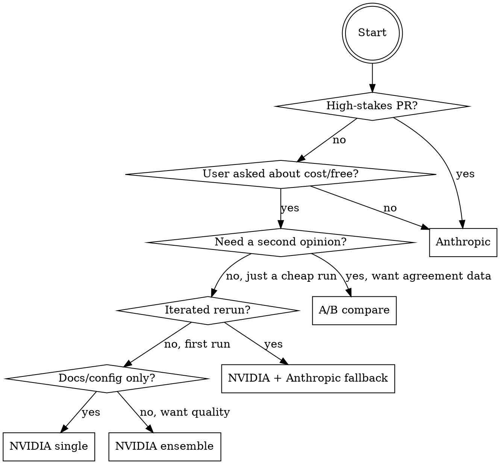

# PR Reviewer Mode — Pick the Right Strategy

The claude-flow PR reviewer (`agent-sdk/pr-reviewer/`) has five meaningfully different ways to run. This skill picks one based on the PR and the ask, then either recommends or executes.

## When to use

- User says "review PR #N" and you want to match mode to context
- User explicitly asks about cost, free inference, NVIDIA, or ensemble
- User wants a second opinion or agreement check between models
- Before invoking `agent-sdk/pr-reviewer/` manually

## When NOT to use

- **Stage-1 triage of a PR** — start with `review-pr` (CodeRabbit-first, cheaper than any LLM)
- **Plan/architecture review** — use `debate-team`
- **Bug investigation on production** — use `bug-fix` or `investigator`
- **Pre-ship checklist** — use `production-readiness-check`

---

## The five modes

| Mode | Cost | Latency | Recall | When it shines |
|---|---|---|---|---|
| **Anthropic** (default) | $ | fast (10–20s, cached) | high | Production PRs, first review, anything high-stakes |
| **NVIDIA single** | free | fast (6–10s) | moderate | Docs/config PRs, cheap rerun, daily high-volume |
| **NVIDIA ensemble** | free | slow (30–120s) | high (via diversity) | Second opinion, free-tier quality boost, high-recall scan |
| **NVIDIA + Anthropic fallback** | free → $ on failure | fast when free works | high (Anthropic) or moderate (NVIDIA) | "Try free first, pay only if needed" — good default for iterated reruns |
| **A/B compare** | $ (pays for Anthropic side) | both sides run sequentially | calibration data, not a review | Answering "does the free ensemble catch what Sonnet catches?" |

All modes feed the same `triage.ts` dedup, so findings are deduped (Dice ≥ 0.25, same file, line ±3) and consensus findings get a `(found by N sources: ...)` annotation.

---

## Decision flow



### Signals for "high-stakes"
- Touches auth, payments, migrations, security-sensitive paths
- PR base branch is `main`/`master` and CI is required
- Author flagged with `@mention` asking for thorough review
- Diff > 200 lines

### Signals for "docs/config only"
- All changed files are `*.md`, `*.txt`, `*.yml`, `*.json`, `*.toml`
- No `*.py`, `*.ts`, `*.js`, `*.go`, `*.rb`, `*.rs`, `*.java`, etc.
- Diff < 50 lines

Use `gh pr diff <N> --name-only` to inspect quickly.

---

## Commands by mode

All commands run from `agent-sdk/pr-reviewer/`. Build first: `npm install && npm run build`.

### Anthropic (default)
```bash
node dist/index.js <PR> --dry-run
```
Uses `ANTHROPIC_API_KEY`. Ephemeral prompt caching kicks in on reruns within 5 min.

### NVIDIA single
```bash
PR_REVIEWER_PROVIDER=nvidia \
  NVIDIA_MODEL=moonshotai/kimi-k2-instruct-0905 \
  node dist/index.js <PR> --dry-run
```
Verify the model is responsive today:
```bash
curl -sH "Authorization: Bearer $NVIDIA_API_KEY" \
  https://integrate.api.nvidia.com/v1/models | jq '.data[].id' | grep -i <model>
```

### NVIDIA ensemble
```bash
PR_REVIEWER_PROVIDER=nvidia \
  NVIDIA_MODEL_POOL="moonshotai/kimi-k2-instruct-0905,deepseek-ai/deepseek-v3.2,minimaxai/minimax-m2.7" \
  NVIDIA_ENSEMBLE_GRACE_MS=60000 \
  node dist/index.js <PR> --dry-run
```
Grace window 60s lets slower but higher-quality models contribute when they're healthy. Drop to 30s if wall time matters more.

### NVIDIA + Anthropic fallback
```bash
PR_REVIEWER_PROVIDER=nvidia \
  NVIDIA_MODEL=moonshotai/kimi-k2-instruct-0905 \
  PR_REVIEWER_FALLBACK_PROVIDER=anthropic \
  ANTHROPIC_MODEL=claude-haiku-4-5 \
  node dist/index.js <PR> --dry-run
```
Haiku as the safety net instead of Sonnet — cheaper catch-net, still higher recall than any free model. Swap to Sonnet for production.

### A/B compare
```bash
npm run compare <PR>
```
Runs Anthropic and NVIDIA back-to-back, prints per-side breakdown + overlap (shared / unique A / unique B) using the same Dice threshold. Costs Anthropic tokens — treat as a measurement tool, not a review mode.

---

## Recipes

### "Cheap rerun after fixing nits"
```bash
PR_REVIEWER_PROVIDER=nvidia NVIDIA_MODEL=moonshotai/kimi-k2-instruct-0905 \
  node dist/index.js <PR> --dry-run
```
Single Kimi in ~6s, free. If it finds nothing new, ship.

### "Free thorough scan — want every issue"
```bash
PR_REVIEWER_PROVIDER=nvidia \
  NVIDIA_MODEL_POOL="moonshotai/kimi-k2-instruct-0905,deepseek-ai/deepseek-v3.2" \
  NVIDIA_ENSEMBLE_GRACE_MS=120000 \
  node dist/index.js <PR> --dry-run
```
Wide grace + two complementary models. Consensus findings get provenance annotations.

### "Free-first, paid only if free models are down"
```bash
PR_REVIEWER_PROVIDER=nvidia \
  NVIDIA_MODEL_POOL="moonshotai/kimi-k2-instruct-0905,deepseek-ai/deepseek-v3.2" \
  PR_REVIEWER_FALLBACK_PROVIDER=anthropic \
  ANTHROPIC_MODEL=claude-haiku-4-5 \
  node dist/index.js <PR> --dry-run
```
Free path first; on total pool failure, Haiku picks up. Logged transition: `[nvidia failed → falling back to anthropic]`.

### "Calibrate — does NVIDIA ensemble catch what Sonnet catches?"
```bash
NVIDIA_MODEL_POOL="moonshotai/kimi-k2-instruct-0905,deepseek-ai/deepseek-v3.2" \
  npm run compare <PR>
```
Output includes `Agreement rate: X%`. Repeat across 3–5 PRs for calibration.

---

## Operational notes

- **Free-tier availability is variable.** Today's responsive models may not be tomorrow's. Start each ensemble session with a tiny `"say hi"` probe per pool member; drop unresponsive ones.
- **Aggressive "find 30 issues" prompts are auto-swapped** for a soft variant when the client reports `preferSoftPrompts=true` (NVIDIA). This is automatic via `pickSystem()` in `reviewers.ts`. Don't remove it — NVIDIA's gateway 504s on the aggressive variant.
- **Semantic dedup threshold** lives in `DEDUP_SIMILARITY_THRESHOLD` (default 0.25). Raise to 0.4 if you're getting over-merging; lower to 0.15 if paraphrases slip through. Don't go below 0.1.
- **CI stays Anthropic-pinned.** `.github/workflows/claude-flow-review.yml` uses only `ANTHROPIC_API_KEY`. Don't change that here; local/manual invocations are where NVIDIA lives.

## Escalation

If this skill's recommendation feels wrong, the user can always invoke one of the backing modes directly. This skill is advisory, not gate-keeping.
