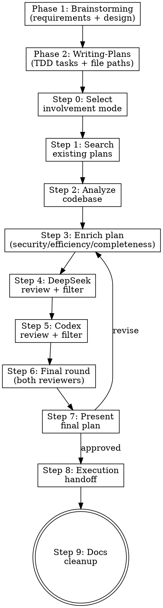

# PlanCraft

## Overview

Multi-agent planning skill that chains five phases:
1. **Brainstorming** — Requirements exploration and design approval
2. **Writing-Plans** — Detailed TDD implementation plan with bite-sized tasks
3. **AI Review** — DeepSeek (security/architecture) + OpenAI (code quality/efficiency) review
4. **Execution** — Automatically invokes `superpowers:executing-plans` when plan is approved
5. **Docs Cleanup** — Automatically invokes `/docs-cleanup` to archive plans and update documentation

**Announce:** "I'm using PlanCraft to create a multi-model reviewed implementation plan. This includes brainstorming, detailed plan writing, AI review, execution, and documentation cleanup."

## Architecture

This skill uses **direct API calls** (not MCP servers). A Python script at `~/.claude/scripts/plancraft_review.py` calls the DeepSeek and OpenAI APIs directly. Claude orchestrates the workflow and calls the script via Bash.

### Prerequisites

Before starting, verify the review script and dependencies exist:

```bash
python3 -c "import httpx; print('httpx OK')" && \
  test -f ~/.claude/scripts/plancraft_review.py && \
  echo "PlanCraft ready"
```

If `httpx` is missing: `pip install httpx`

API keys must be set as environment variables:
- `DEEPSEEK_API_KEY` — Get from https://platform.deepseek.com/api_keys
- `OPENAI_API_KEY` — Get from https://platform.openai.com/api-keys

The script auto-loads keys from shell config files (`~/.zshrc`, `~/.bash_profile`, `~/.bashrc`, `~/.zprofile`) if they aren't in the current environment. No manual `source` is needed.

Check: `python3 ~/.claude/scripts/plancraft_review.py --reviewer deepseek --plan-file /dev/null --scope-file /dev/null 2>&1 | head -1` (should not show "API key not set" error)

## Workflow



## Phase 1: Brainstorming

**Before any planning begins, run a brainstorming session.** This explores requirements and creates a validated design document.

<HARD-GATE>
Do NOT proceed to planning steps until brainstorming is complete and a design document has been approved by the user.
</HARD-GATE>

### Brainstorming Checklist

Create a task for each item and complete in order:

1. **Explore project context** — check files, docs, recent commits relevant to the feature
2. **Ask clarifying questions** — one at a time, understand purpose/constraints/success criteria
3. **Propose 2-3 approaches** — with trade-offs and your recommendation
4. **Present design** — in sections scaled to complexity, get user approval after each section
5. **Write design doc** — save to `docs/plans/YYYY-MM-DD-<topic>-design.md` and commit
6. **Extract scope** — from the approved design, define explicit In Scope / Out of Scope lists

### Brainstorming Process

**Understanding the idea:**
- Check out the current project state first (files, docs, recent commits)
- Ask questions one at a time to refine the idea
- Prefer multiple choice questions when possible
- Focus on understanding: purpose, constraints, success criteria

**Exploring approaches:**
- Propose 2-3 different approaches with trade-offs
- Lead with your recommended option and explain why
- Present options conversationally

**Presenting the design:**
- Scale each section to its complexity (few sentences if simple, 200-300 words if nuanced)
- Ask after each section whether it looks right so far
- Cover: architecture, components, data flow, error handling, testing

**Documentation:**
- Write the validated design to `docs/plans/YYYY-MM-DD-<topic>-design.md`
- Commit the design document to git
- This design doc becomes the foundation for Phase 2

## Phase 2: Writing-Plans

**After brainstorming is complete, invoke the `superpowers:writing-plans` skill** to create a detailed implementation plan with bite-sized TDD tasks.

<HARD-GATE>
Do NOT proceed to AI review until writing-plans has created a complete implementation plan with exact file paths and test steps.
</HARD-GATE>

### What Writing-Plans Adds

The writing-plans skill creates implementation plans with:

- **Bite-sized tasks** (2-5 minutes each): test → verify fail → implement → verify pass → commit
- **Exact file paths** with line numbers for modifications
- **Complete code** in the plan (not vague instructions like "add validation")
- **Exact test commands** with expected output
- **TDD enforcement** throughout

### Writing-Plans Invocation

After brainstorming produces an approved design doc:

1. **Invoke the skill:** Use the Skill tool with `skill: "superpowers:writing-plans"`
2. **Provide context:** The design doc from Phase 1 is the input
3. **Output:** A detailed plan saved to `docs/plans/YYYY-MM-DD-<feature-name>.md`

The plan from writing-plans then goes through AI review in Steps 4-6.

## Involvement Modes

Ask user at Step 0 (after brainstorming) via AskUserQuestion:

| Mode | Behavior |
|------|----------|
| **Silent** | No pauses until final approval. All decisions logged in summary. |
| **Balanced** | Notify on scope-creep rejections or major design changes. |
| **Consultative** | Approve each suggestion batch before applying. |

## How to Call Reviewers

The review script reads plan and scope from temporary files and outputs JSON to stdout.

### Calling a Reviewer

**Step 1:** Write the current plan text to a temp file:
```bash
cat > /tmp/plancraft_plan.md << 'PLAN_EOF'
<paste plan text here>
PLAN_EOF
```

**Step 2:** Write the scope definition to a temp file:
```bash
cat > /tmp/plancraft_scope.txt << 'SCOPE_EOF'
In Scope: <list>
Out of Scope: <list>
SCOPE_EOF
```

**Step 3:** Call the reviewer:
```bash
python3 ~/.claude/scripts/plancraft_review.py \
    --reviewer deepseek \
    --plan-file /tmp/plancraft_plan.md \
    --scope-file /tmp/plancraft_scope.txt
```

Or for OpenAI/Codex:
```bash
python3 ~/.claude/scripts/plancraft_review.py \
    --reviewer codex \
    --plan-file /tmp/plancraft_plan.md \
    --scope-file /tmp/plancraft_scope.txt
```

**Step 4:** Parse the JSON output. Keys: `recommendations`, `model`, `token_usage`, `error`

### Running Both Reviewers in Parallel

For Step 7 (final review), run both reviewers concurrently using two Bash calls in the same message. Both read from the same temp files.

## Step-by-Step Instructions

### Phase 1 — Brainstorming (REQUIRED)

Complete the brainstorming checklist before proceeding:

1. **Explore project context**
   - `Glob` for relevant files, `Read` docs, check recent commits
   - Understand current state and constraints

2. **Ask clarifying questions** (one at a time)
   - Use AskUserQuestion with multiple choice options when possible
   - Understand: purpose, constraints, success criteria, edge cases
   - Continue until you have a clear picture of the requirement

3. **Propose 2-3 approaches**
   - Present trade-offs for each approach
   - Lead with your recommendation and explain why
   - Get user input on preferred direction

4. **Present design sections**
   - Architecture, components, data flow, error handling, testing
   - Ask for approval after each major section
   - Revise based on feedback

5. **Write design doc**
   - Save to `docs/plans/YYYY-MM-DD-<topic>-design.md`
   - Commit to git
   - This becomes the foundation for planning

6. **Extract scope from design**
   - Define explicit **In Scope** list from approved design
   - Define explicit **Out of Scope** list (what was discussed but excluded)
   - Write scope to `/tmp/plancraft_scope.txt`

### Phase 2 — Writing-Plans (REQUIRED)

After brainstorming produces an approved design:

1. **Invoke the writing-plans skill**
   ```
   Use Skill tool: skill: "superpowers:writing-plans"
   ```

2. **The writing-plans skill will:**
   - Read the design doc from Phase 1
   - Create bite-sized TDD tasks (2-5 min each)
   - Include exact file paths and complete code
   - Save to `docs/plans/YYYY-MM-DD-<feature-name>.md`

3. **After writing-plans completes:**
   - The implementation plan is ready for AI review
   - Write the plan to `/tmp/plancraft_plan.md` for reviewers
   - Proceed to Step 0

### Step 0 — Select Mode
1. Ask involvement mode (Silent/Balanced/Consultative) via AskUserQuestion
2. Confirm scope definition from brainstorming phase
3. Proceed to AI review with the plan from writing-plans

### Step 1 — Search Existing Plans
1. `Glob` for `*.plan.md`, `*.design.md`, `docs/plans/*`
2. `Read` discovered docs, merge prior decisions
3. No pause unless scope fundamentally changes

### Step 2 — Analyze Codebase
1. `Grep` + `Glob` + `Read` for relevant source files
2. `Task` (Explore subagent) for deep analysis if needed
3. Update plan to align with actual code

### Step 3 — Enrich Plan
1. Synthesize steps 1-2 into detailed plan
2. Address: security, efficiency, completeness, error handling
3. Write plan to `/tmp/plancraft_plan.md`
4. Checkpoint (Consultative): enriched plan ready

### Step 4 — DeepSeek Review
1. Call via Bash:
   ```bash
   python3 ~/.claude/scripts/plancraft_review.py \
       --reviewer deepseek \
       --plan-file /tmp/plancraft_plan.md \
       --scope-file /tmp/plancraft_scope.txt
   ```
2. Parse JSON response, extract `recommendations`
3. If `error` key present and non-empty, log error and continue
4. **Filter each recommendation:**
   - ACCEPT if improves security/efficiency/completeness AND marked IN_SCOPE
   - REJECT if marked OUT_OF_SCOPE or expands scope → log as "scope creep"
5. Notify per mode (Silent: log only; Balanced: if rejections; Consultative: full list)
6. Apply accepted suggestions to plan, update `/tmp/plancraft_plan.md`

### Step 5 — Codex Review
1. Call via Bash:
   ```bash
   python3 ~/.claude/scripts/plancraft_review.py \
       --reviewer codex \
       --plan-file /tmp/plancraft_plan.md \
       --scope-file /tmp/plancraft_scope.txt
   ```
2. Same filter/log/notify logic as Step 4
3. Apply accepted suggestions, update `/tmp/plancraft_plan.md`

### Step 6 — Final Review Round
1. Send revised plan to **both** reviewers (run in parallel — two Bash calls in one message)
2. Resolve conflicts: **Security > Efficiency > Code Style**
3. Same filter/notify logic
4. Apply final accepted suggestions

### Step 7 — Finalize & Present
1. Compile final plan with Review Log section:
   - Adopted suggestions (source + reason)
   - Rejected suggestions (source + reason)
   - Scope maintenance log
   - Autonomous decisions (in Silent/Balanced)
2. Update the plan file in `docs/plans/`
3. Present to user for final approval
4. Clean up temp files:
   ```bash
   rm -f /tmp/plancraft_plan.md /tmp/plancraft_scope.txt
   ```

### Step 8 — Execution Handoff

After plan approval, **automatically invoke the executing-plans skill** to begin implementation:

1. **Announce:** "Plan approved. Starting execution with the executing-plans skill."

2. **Invoke the skill:**
   ```
   Use Skill tool: skill: "superpowers:executing-plans"
   ```

3. **The executing-plans skill will:**
   - Read the implementation plan from `docs/plans/`
   - Execute tasks sequentially with TDD discipline
   - Commit after each completed task
   - Pause for review at checkpoints

<HARD-GATE>
Do NOT ask the user which execution approach to use. Always invoke `superpowers:executing-plans` automatically when the plan is approved.
</HARD-GATE>

### Step 9 — Documentation Cleanup

After execution completes, **automatically invoke the docs-cleanup skill** to clean up project documentation:

1. **Announce:** "Implementation complete. Running documentation cleanup."

2. **Invoke the skill:**
   ```
   Use Skill tool: skill: "docs-cleanup"
   ```

3. **The docs-cleanup skill will:**
   - Archive the completed plan to `docs/archive/plans/`
   - Clean up any outdated documentation
   - Update relevant docs to reflect new implementation
   - Remove temporary or redundant files

<HARD-GATE>
Do NOT skip documentation cleanup. Always invoke `docs-cleanup` after execution completes successfully.
</HARD-GATE>

## Scope Enforcement

- Every plan MUST have In Scope / Out of Scope section
- Send scope definition with every review call
- Suggestions adding unlisted functionality → REJECT as scope creep
- If uncertain → flag for user decision in final summary
- User can explicitly expand scope (logged as conscious decision)

## Decision Log Format

```
- [ACCEPTED] Source: DeepSeek | "recommendation text" | Reason: why accepted
- [REJECTED] Source: Codex | "recommendation text" | Reason: scope creep
```

## Final Plan Output Template

```markdown
# Implementation Plan: [Feature Name]

**Design Document:** `docs/plans/YYYY-MM-DD-<topic>-design.md`

## Scope
### In Scope
### Out of Scope

## Technical Approach
(Derived from approved design document)

## Implementation Steps
1. Step with file references
2. ...

## Security Considerations
## Testing Strategy

## Review Log
### Adopted Suggestions
### Rejected Suggestions
### Scope Maintenance
### Autonomous Decisions
```

## Common Mistakes

| Mistake | Fix |
|---------|-----|
| **Skipping brainstorming** | ALWAYS complete Phase 1 first — no exceptions for "simple" projects |
| **Skipping writing-plans** | ALWAYS invoke `superpowers:writing-plans` after brainstorming |
| Jumping to planning without design approval | Get explicit user approval on design before proceeding |
| Accepting all suggestions blindly | Filter every suggestion against scope definition |
| Skipping scope section | Scope section is mandatory — reject plan without it |
| Not logging rejections | Every rejection must be logged with reason |
| Running reviews without scope | Always write scope file before calling reviewer |
| Ignoring API errors | Log error, continue with available info, note in summary |
| Not cleaning up temp files | Always rm temp files after finalization |
| Using MCP tools instead of Bash | This skill uses direct API calls via `plancraft_review.py` |
| Asking multiple questions at once | One clarifying question per message during brainstorming |
| Skipping execution handoff | Always invoke `superpowers:executing-plans` after plan approval |
| Skipping docs cleanup | Always invoke `docs-cleanup` after execution completes |

## Error Handling

- If `httpx` is not installed → tell user to run `pip install httpx`
- If API key missing → script auto-sources shell config files; if still missing, result JSON will contain error message
- If API call fails → script retries once, then returns error in JSON
- If one reviewer fails → continue with the other; note gap in review log
- If both fail → present plan without AI review, flag as "unreviewed"
